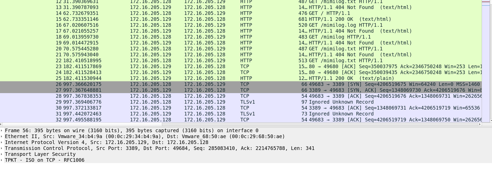
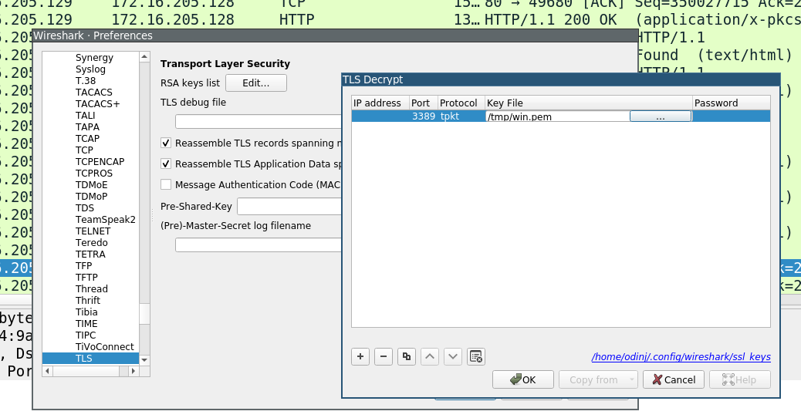
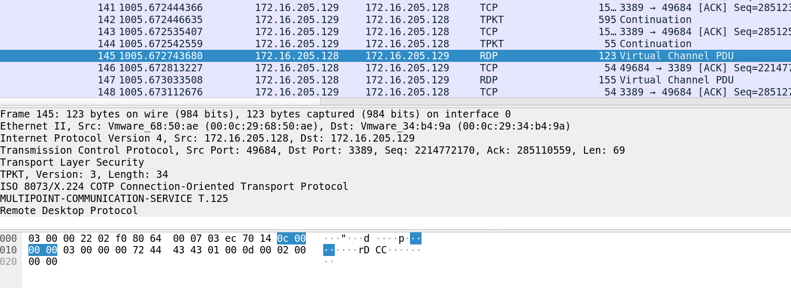
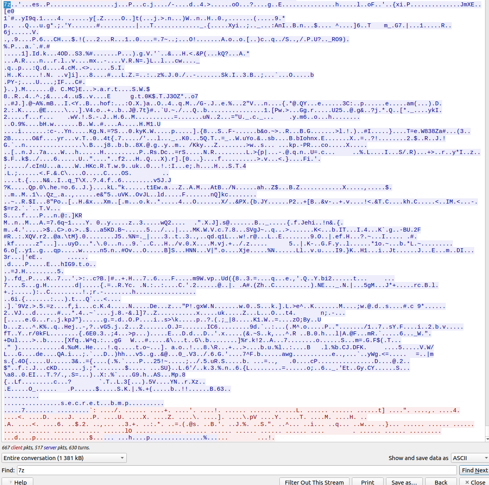

# Writeup [Remote Digital Problem](README.md)
**Author: zup, bolzzy, odin**

**Difficulty: hard**

**Category: forensics** 

The ship's SOC has detected some abnormal traffic between internal servers. 
They have captured a PCAP of the traffic, can you help them to find out if this 
is a problem?

---

_There are multiple ways of solving this challenge, either by using online tools that parses 
RDP traffic or to carve stuff out of the PCAP manually / by scripting._

Opening the PCAP in wireshark shows that there are two different types of communication; TLS encrypted RDP (Remote Desktop) and HTTP. 



In the HTTP communication, there are several files that are downloaded from a webserver:

1. Mimilog.txt
2. cert.pfx
3. cert.der

Looking into the content of mimilog.txt, it is possible to see that this is a log file from Mimikatz:

```
HTTP/1.1 200 OK
Content-Type: text/plain
Last-Modified: Fri, 06 Mar 2020 20:18:00 GMT
Accept-Ranges: bytes
ETag: "7b292355f4f3d51:0"
Server: Microsoft-IIS/7.5
Date: Fri, 06 Mar 2020 20:32:08 GMT
Content-Length: 3914

Using 'sekurlsa.log' for logfile : OK

mimikatz # sekurlsa::logonpasswords
...
```

Since we know that Mimikatz is used, and we have an encrypted RDP session, it is most likely certificates that 
can be used to decrypt the TLS sessions. To decrypt the TLS session in Wireshark, it is necessary to convert 
the pfx to a PEM format. The convertion can be performed with the following command:

```bash
openssl pkcs12 -in cert.pfx -out win.pem -nodes
```

When executing the command, it is necessary to provide a password. This is the default behavior of Mimikatz
when extracting certificates using the `crypto::certificates` module. See 
[this link](https://github.com/gentilkiwi/mimikatz/wiki/module-~-crypto#certificates) for more info
about this module. It says that the password should be _mimikatz_. 
The win.pem can be added to wireshark under Edit->Preferences->Protocols->TLS->RSA key list (edit):



After adding this option, it is possible to see that Wireshark provides a second view of packet details, 
that shows decrypted data:




Now that we are able to see the decrypted RDP data, we can analyze the content.
Note that RDP data usually is compressed by default, however it was disabled during this challenge 
to make it a bit easier.
As RDP usually consists of bitmap data, we can instead look for other hints that might not be imagedata.
A good trick is to extract the decrypted TLS stream in Wireshark to another file. This can be done by
selecting a TLS stream and changing the "Show and save data as" to "raw" and then click "Save as..." to disk.

Let's search for anything that looks like a string. Since this traffic is full of UTF16 encoded strings
we can use `strings` in UTF16 mode to search for clues:

```bash
$ strings -e l ./stream.bin

DESKTOP-3SHTQ0R
DESKTOP-3SHTQ0R
Microsoft Software Printer Driver
OneNote
Microsoft Shared Fax Driver
Microsoft Print To PDF
Microsoft Print to PDF
Microsoft XPS Document Writer v4
Microsoft XPS Document Writer
computersarefun
FileGroupDescriptorW
FileContents
Preferred DropEffect
secret.7z
secret.bmp
secret.7z
secret.bmp
secret.bmp
```

We see strings like "secret.7z" and "secret.bmp"!
This is a good indication that a file has been transferred over RDP. Files and clipboard data transferred
over RDP is located in the _virtualChannelData_ field.
We can either extract this file manually via Wireshark or by scripting using _tshark_.
There are many ways of doing this. One way (which might be the fastest one) is to just use binwalk on the
downloaded unencrypted TLS stream and see if it finds any 7z files:

```console
$ binwalk stream.bin
DECIMAL       HEXADECIMAL     DESCRIPTION
--------------------------------------------------------------------------------
332           0x14C           Certificate in DER format (x509 v3), header length: 4, sequence length: 538
1905          0x771           LZMA compressed data, properties: 0x64, dictionary size: 67108864 bytes, uncompressed size: 352324800 bytes
1983          0x7BF           LZMA compressed data, properties: 0x63, dictionary size: -2147483648 bytes, uncompressed size: 146802368 bytes
14684         0x395C          LZMA compressed data, properties: 0x66, dictionary size: -2046296064 bytes, uncompressed size: 54937 bytes
19844         0x4D84          LZMA compressed data, properties: 0x66, dictionary size: -2046296064 bytes, uncompressed size: 54937 bytes
...
1351883       0x14A0CB        LZMA compressed data, properties: 0x88, dictionary size: -694616064 bytes, uncompressed size: 3600406169 bytes
1367619       0x14DE43        7-zip archive data, version 0.4
1376204       0x14FFCC        7-zip archive data, version 0.4
```

It finds a lot of LZMA compressed data (which 7-zip uses), however when extracted using binwalk there are a few issues with unzipping
the file using 7z. Binwalk probably finds a lot of false positives.

When inspecting the TLS stream in Wireshark using the `rdp.virtualChannelData` filter, we can take a look at the different packet sizes.
There are a few ones that stick out. For example packet 2593 (The number far left in Wireshark packet view) that contains a lot of 
nullbytes and the 7z filename 'secret.7z' that we found earlier using strings. A few more packets after that is where we find
the actual 7z data (2598). The 7z data is split between 3 packets. 


In the TLS stream view, the data looks like this!



Another way is to extract the stream from the PCAP file and manually isolate the 7z part of it. When using the 
`rdp.virtualChannelData` filter, these packets are actually packet number 88, 89 and 90 in the list, so they can 
easily be extracted using a script. However, we notice that there are a few bytes of data in packet 88 before
the actual 7z header. This data should be removed before concatenating these packets.
At the bottom of the writeup is a script to extract, decrypt and decompress the 7z archive from the PCAP.

After extracting the 7z archive using any of the methods above, we need a password to decrypt it.
Looking a bit further up in the same decrypted RDP stream, we find `computersarefun`. 
That seems like a fitting password as this also looks like it has been copied over from one machine
to the other.

Using this password to unlock the 7z we get the "secret.bmp" image containing the flag:

```
TG20{rdp_transfer_is_wicked}
```

### Alternative method - RDP-replay
It is also possible to solve this challenge using [RDP-replay](https://github.com/ctxis/RDP-Replay), 
a tool that can replay the RDP traffic in the pcap and create a video of what is going on. 
It is probably more fun to solve it using this method, since you get to see the actual replay of
what happened during the RDP session. There were quite a few teams solving it this way. 

RDP-replay is quite old, so you have to run it in an 
older version of ubuntu or something similar. We used Ubuntu 14.04 to replay traffic. 
After building RDP-replay we run:

```console
$ replay/rdp_replay -r ../capture.pcap -p ../win.pem -o ~/Documents/RDP-Replay/vid.avi --show_keys --save_clipboard --clipboard_16le
```

However it doesn't seem like this works. It says that it found a valid SSL private key, but nothing happens. 
This is because there is a broken RDP session in the beginning of the PCAP file that needs to be removed. 
After stripping the PCAP file it works and will play a nice movie of what happened during the RDP session.


We can see that there is a BMP file that gets compressed and encrypted using 7z. The password is pasted in
through the RDP session. The 7z file is then copied back through the RDP session. In the clipboard files 
generated by RDP-replay, we can see that the password for the 7z file is `computersarefun`. But how to get
the 7z file that got copied? 

The file will not show up in the saved clipboard files, since large files are
sent through their own channels. We can however get RDP-replay to display messages from all channels using
`--debug_chan` and then look for the 7z magic bytes `377abcaf271c`. 

It looks like there is a zip file in Channel 1006, but there is some junk before the 7z header begins. After removing
this junk, we can echo the hex string and convert it from hex using xxd. Some of the hex string has been removed in the
command below due to the long string :)

```
$ echo -n "377abcaf271c000465737f1c5011000(...)6010020000000000000000000" | xxd -r -p > secret.7z
```

Now we can unzip it using the correct password and get the flag!


### Script to solve the challenge
The script requires python 3.7 or above (Which you probably should start using soon anyway :P).
If this is an issue, remove the `f`'s in front of the different strings and add a `.format(<variable name>=<variable name>)`
behind each of the strings to make it work :)

```python
#!/usr/bin/env python3
# -*- coding: utf-8 -*-

import sys
import subprocess
import binascii

def out_to_bin(filename, out):
    with open(filename, "wb") as f:
        f.write(binascii.unhexlify(out))

def main():
    rdp_file = b""
    archive = "secret.7z"
    password = "computersarefun"
    pcap_file = "../uploads/capture.pcap"
    certificate = "win.pem"

    if len(sys.argv) > 1:
        pcap_file = sys.argv[1]
        if len(sys.argv) > 2:
            certificate = sys.argv[2]

    print(f"[*] Decrypting and extracting packets from '{pcap_file}' using '{certificate}'...")
    out = subprocess.check_output(f"tshark -r '{pcap_file}' -q -o 'tls.keys_list:,3389,tpkt,{certificate}' -T fields -e 'rdp.virtualChannelData'",
                                  shell=True)

    outs = out.split("\n".encode())
    outs = [out for out in outs if len(out) != 0]

    for i, out in enumerate(outs):
        # 88 is the first packet that includes the 7z file.
        if i == 88:
            # Strip off some junk before the actual 7z file
            out = out[24:]

        # The 7z file is split into these three packets in the pcap file.
        # (using the rdp.virtualChannelData filter)
        if i in (88, 89, 90):
            rdp_file += out.strip(b"\t")

    print(f"[*] Writing encrypted archive file '{archive}'")
    out_to_bin(archive, rdp_file)

    print(f"[+] Extracting '{archive}' using password '{password}'")
    subprocess.check_output(f"7z x -p{password} {archive}", shell=True)

if __name__ == '__main__':
    main()
```
