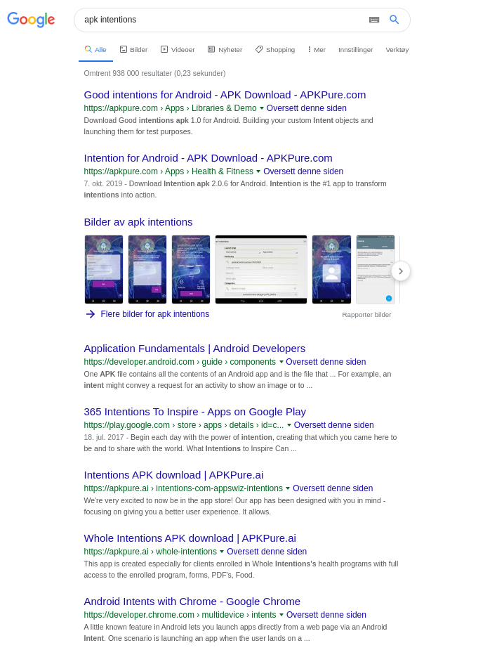

# Writeup [Bad intentions](./README.md)

## Task description
**Author: maritio_o**

**Difficulty: easy**

**Category: RE** 

Someone found this very old game lying around. Apparently there is an
extremely funny joke in there somewhere.

Here, take this [APK](uploads/gaiainvaders.apk).

<details><summary>Hint</summary><p>

Random title?

</p></details>

---

## Writeup
In this task, you got an APK file. [APK](https://en.wikipedia.org/wiki/Android_application_package)
is short for `Android Package`, and is an Android application package. It
is the same type of file as the apps Android users download to their phones. 
You can think of the as the Android mobile app file extension, just like the 
.exe extension is for files on Windows machines. 

As stated in the hint dropdown, the title contains a hint. This might not be 
a very
good hint for those who have never done mobile reversing or mobile development,
but we will figure out this together! When googling for 
`APK Bad Intentions`, I get hits like a song I've never heard of by a 
woman called "Niykee Heaton", or Dr.Dre's song "Bad Intention". Okey, so no
luck with that. So I check if intentions is a thing by googling for `APK
intentions`. Now, I get more suitable hits, such as some of those in the
picture below. 



Now, going to either the [3rd](https://developer.android.com/guide/components/fundamentals) 
or [7th](https://developer.chrome.com/multidevice/android/intents) google hit, 
you get to read about `Android intents`. Intents are _really_ important in the 
Android app world. It is very important for the security as well. 

Intents are used to start services on your phone. In short, if the 
`android:exported` value of an intent is set to "true", it can be reached from
outside of the mobile app. This means that one app can start another app's 
components, or other apps can start your app's components. However, this
value is "false" by default. When it is "false", external apps may not reach
the component.

Okay, so how do we check if there is any intents in the provided APK that has 
their `android:exported` value set to "true"? There are several ways to do this.
The easiest way would be to read the file called `AndroidManifest.xml`. The 
AndroidManifest.xml file contains all the information about the intents of an
app. 

One way to find this information is to run the `aapt` command in the folder
containing the `gaiainvaders.apk` file:
```console
$ aapt dump xmltree gaiainvaders.apk AndroidManifest.xml
```

This command will among other things output the following information:
```
	E: activity (line=19)
        A: android:name(0x01010003)="no.tghack.gaiainvaders.GaiaInvadersActivity" (Raw: "no.tghack.gaiainvaders.GaiaInvadersActivity")
        E: intent-filter (line=20)
          E: action (line=21)
            A: android:name(0x01010003)="android.intent.action.MAIN" (Raw: "android.intent.action.MAIN")
          E: category (line=23)
            A: android:name(0x01010003)="android.intent.category.LAUNCHER" (Raw: "android.intent.category.LAUNCHER")
    E: activity (line=26)
        A: android:name(0x01010003)="no.tghack.gaiainvaders.JokeActivity" (Raw: "no.tghack.gaiainvaders.JokeActivity")
        E: intent-filter (line=27)
          E: action (line=28)
            A: android:name(0x01010003)="android.intent.action.MAIN" (Raw: "android.intent.action.MAIN")
          E: category (line=30)
            A: android:name(0x01010003)="android.intent.category.LAUNCHER" (Raw: "android.intent.category.LAUNCHER")
```

This output show us two activities. One of the activities looks a bit funny. 
No pun intended. Now, the thing here is that an intent filter will set the 
value of `android:exported` to "true". Since both activities has intent-filters,
we know that both the 
GaiaInvadersActivity and the JokeActivity can be opened from outside the app. 
You can read more about Android intents and intent filters [here](https://developer.android.com/guide/components/intents-filters).

Another very common way is to read the decompiled AndroidManifest.xml file. 
The file shows the exact same output as above. It is very common to use a tool
like [jadx](https://github.com/skylot/jadx) to decompile the Android app binary code. 
With the tool installed, you can run the GUI with the following command:
```console
$ jadx-gui gaiainvaders.apk
```

Now, you will be able to see the AndroidManifest file in the XML format. The 
information gathered from using the `aapt` command above looks like this:
```
        <activity android:name="no.tghack.gaiainvaders.GaiaInvadersActivity">
            <intent-filter>
                <action android:name="android.intent.action.MAIN"/>
                <category android:name="android.intent.category.LAUNCHER"/>
            </intent-filter>
        </activity>
        <activity android:name="no.tghack.gaiainvaders.JokeActivity">
            <intent-filter>
                <action android:name="android.intent.action.MAIN"/>
                <category android:name="android.intent.category.LAUNCHER"/>
            </intent-filter>
        </activity>
```

The reason we need to decompile the code is that APKs are just zipped folders
containing something called Dalvik files. Dalvik files has the suffix `.dex` 
and are binary files. Binary files are unreadable by humans, so we need to make
them readable. It is possible to decompile to either Smali, which is like 
Assembly language for APKs, or to Java source code. If using jadx-gui, then 
you are doing the latter. 

Alright, back to the challenge! Based on the knowledge we just gained, we know
that we need to figure out how to run the JokeActivity. 
The task descriptions said something about an extremely funny joke somewhere
in the app, so it seems likely to be what we are looking for. 

BUUUT, this is easier said then done because it requires some setup. You need
to run an emulator and have [Android Debug Bridge (ADB)](https://developer.android.com/studio/command-line/adb)
installed. Now, it is a little too much to explain how to setup everything, so 
my advice is to use you googling skills, search for how to setup Android 
Emulator on your distro. It is common to use Android Studio and install the 
emulator using the AVD manager. 

With everything in place, it is time to run the emulator and the activities. 
First, you must run the emulator. If not, you won't be able connect with ADB 
and you terminal will output the following:
```console
➜  ~ adb shell
error: no devices/emulators found
```

Having the emulator running, you must install the app. You can install the app
with ADB. Run the following commands to install the app, and then run the 
JokeActivity:

1. Install
```console
✗ adb install gaiainvaders.apk
Success
```

2. Run the JokeActivity
```console
✗ adb shell am start -n "no.tghack.gaiainvaders/.JokeActivity"
Starting: Intent { cmp=no.tghack.gaiainvaders/.JokeActivity }
```

And then just get the answer of the _extremely funny joke_, and TADA....!

```
TG20{criminal_intent}
```
